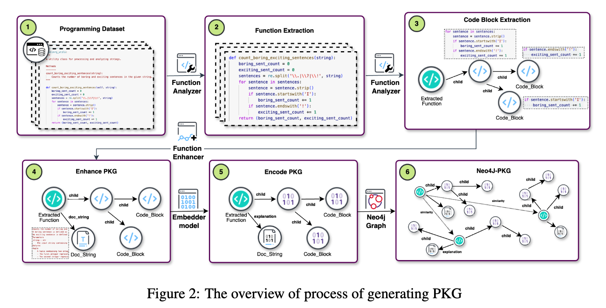

# Context-Augmented Code Generation Using Programming Knowledge Graphs

This repository accompanies the research paper ["Context-Augmented Code Generation Using Programming Knowledge Graphs"](https://arxiv.org/pdf/2410.18251) and provides the implementation for a novel framework leveraging a Programming Knowledge Graph (PKG) to enhance code generation using Retrieval-Augmented Generation (RAG).

Overview
Large Language Models (LLMs) and Code-LLMs (CLLMs) excel in code generation tasks but struggle with complex problems due to irrelevant or incomplete contexts. This project introduces a PKG-based framework to address these challenges by:

**Fine-grained Code Retrieval:** Using tree-pruning techniques to focus on the most relevant code segments while minimizing irrelevant context.
**Re-ranking Mechanism:** Reducing hallucinations by selectively integrating retrieved context with non-RAG solutions.
**Fill-in-the-Middle (FIM) Enhancement:** Automatically augmenting code with comments and docstrings for better generation accuracy.




## Key Contributions
**PKG-Based Retrieval:** Semantic representation and retrieval of code at fine granularity levels (block-wise and function-wise).
**Tree Pruning:** Improved retrieval precision by pruning irrelevant branches in the knowledge graph.
**Re-ranking Solutions:** Selecting robust solutions to reduce hallucination in generated code.
**FIM Enhancer Module:** Automatic augmentation of code with relevant metadata.

Our method achieves:
Up to 20% improvement in pass@1 accuracy.
Outperformance of state-of-the-art models by 34% on MBPP.


## Getting Started

### Prerequisites
Python 3.8+

Neo4j, APOC and Graph Data Science for knowledge graph management.

Install dependencies:

```bash
pip install -r requirements.txt
```

`function_analyzer.py` is responsible to extract code blocks.

By `function_enhancer.py` you can enhance python function blocks using FIM objective function.

`knowledge_programming_graph.py` is used to generate nodes and realtions corresponded to extracted function block in json files.

Using `neo4j_graph.ipynb` you can use the previous json files to create a neo4j knowledge graph and retrieve similar path and contents of HumanEval and MBPP benchmarks. The results are save on augmented problems folder.


In `code_generation.py` you can load this augmented problems in prompts and evaluate the result of different models when they are augmented using PKG.

## Citation

If you find this work useful, please consider citing:

```sql
@article{your_paper,
  title={Context-Augmented Code Generation Using Programming Knowledge Graphs},
  author={Iman Saberi and Fatemeh Fard},
  year={2024}
}
```

